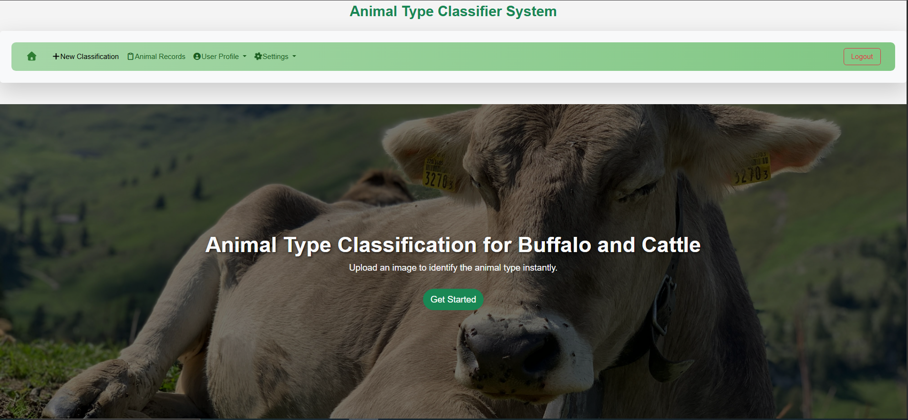
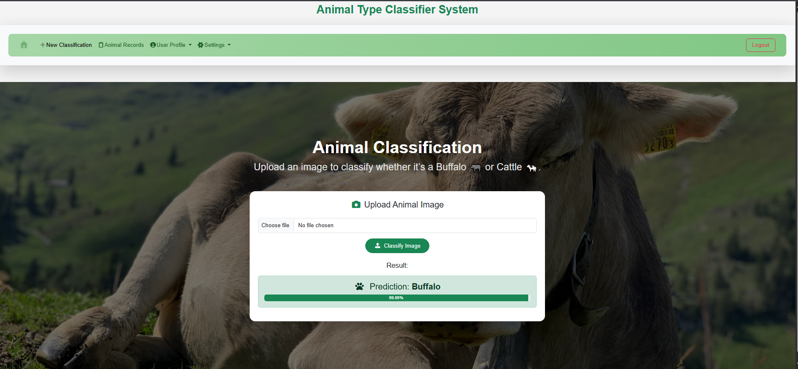
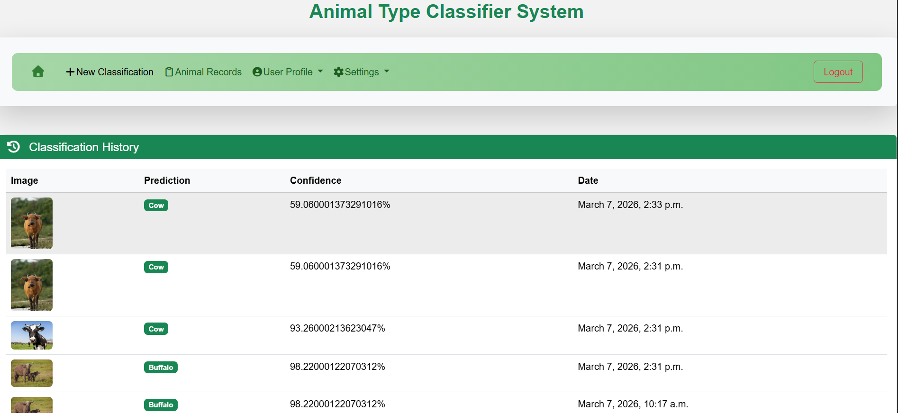
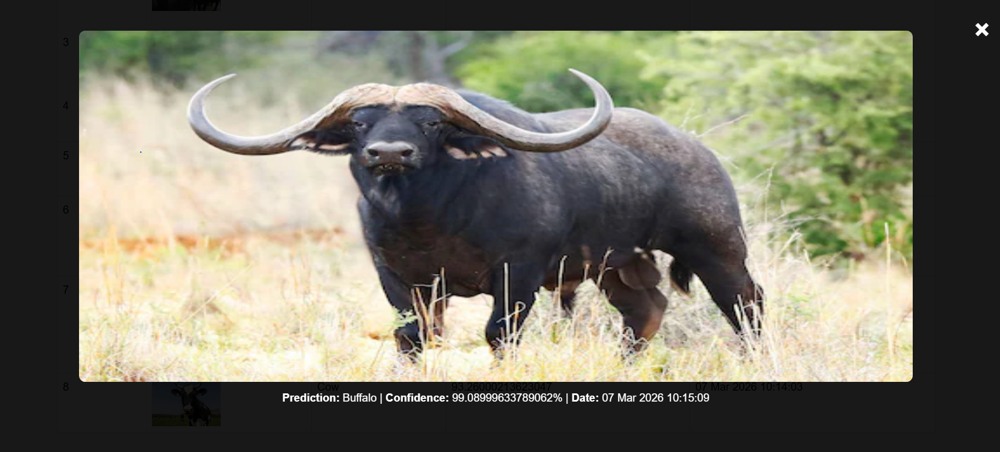
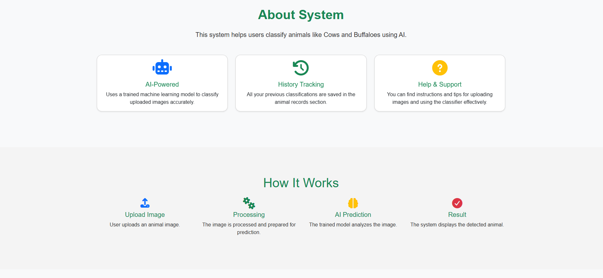
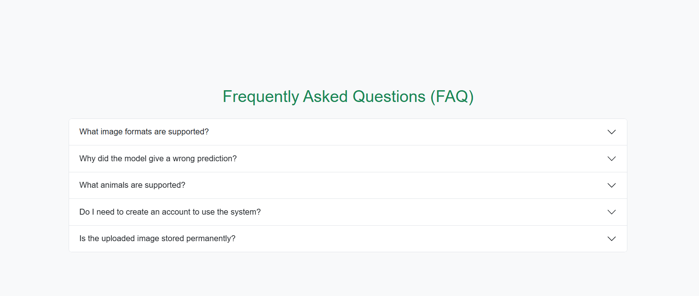
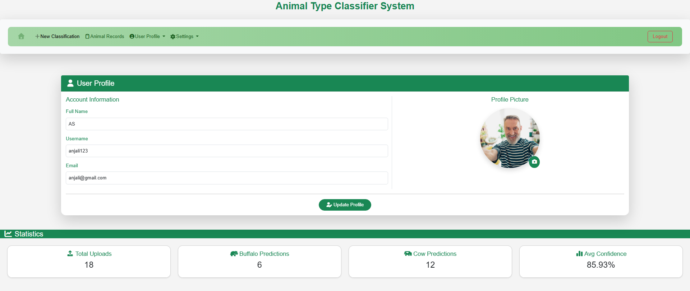
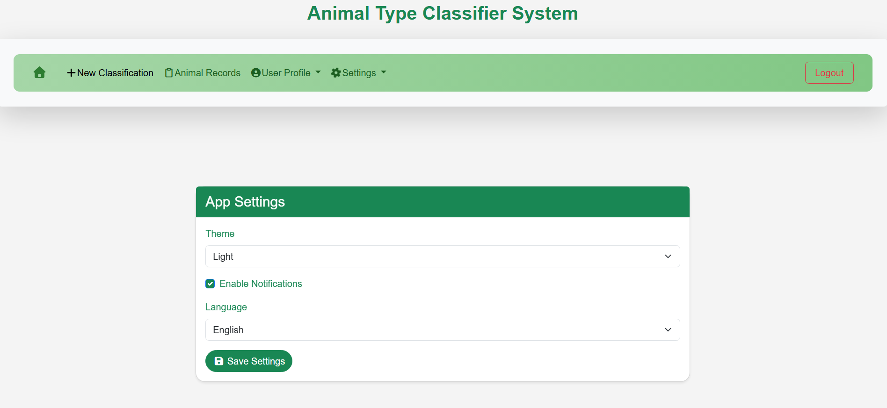
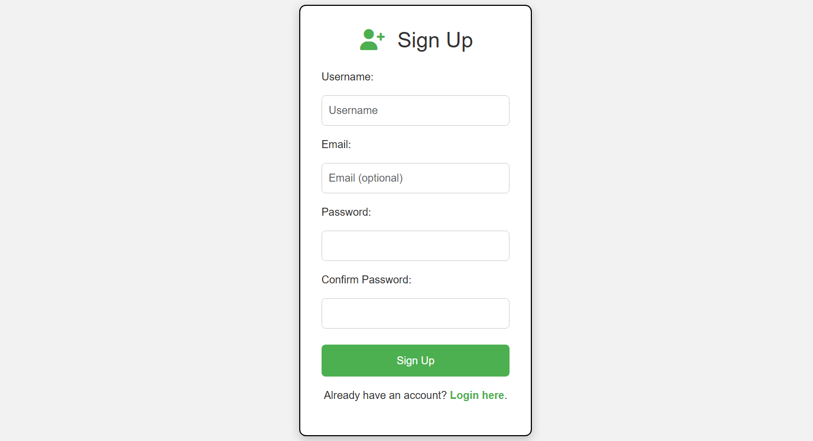
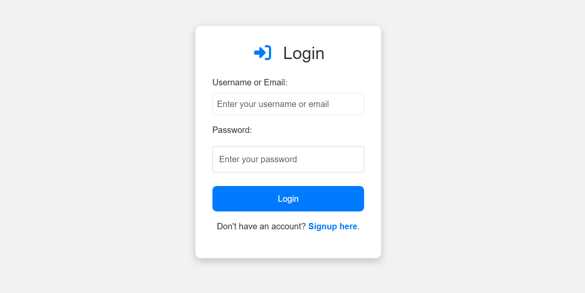

# Animal Classification System for Cow and Cattle

A Django-based web application that classifies animals using a trained TensorFlow/Keras deep learning model.

---

## Project Overview

This project allows users to upload an image of an animal, and the system predicts the animal species using a trained deep learning model.

The web interface is built using Django, while the model is developed using TensorFlow and Keras.

---

## Features

- User Login and Signup Authentication
- Image Upload
- Animal Image Classification for cow and cattle
- user Profile
- Statistics 
- Trained Deep Learning Model
- Clean Django Web Interface
- Settings Page (Theme, Language, Notifications)

---

## 🛠 Tech Stack

Frontend:
- HTML
- CSS
- Bootstrap
- JS

Backend:
- Django (Python)

Machine Learning:
- TensorFlow
- Keras
- NumPy
- Pillow

---

## Project Structure

```
animal/
│
├── animal/           # Django project
├── myapp/            # Main app
├── dataset/          # Training dataset (ignored in GitHub)
├── model/            # Trained ML model
├── static/           # CSS, JS
├── media/            # Uploaded images
├──screenshots/
├── manage.py
├── requirements.txt
└── README.md
```

---

##  Installation

Clone the repository:

```
git clone https://github.com/Anjali-990/animal-classification.git
```

Move into the project folder:

```
cd animal-classification
```

Install dependencies:

```
pip install -r requirements.txt
```

Run the server:

```
python manage.py runserver
```

Open in browser:

```
http://127.0.0.1:8000
```

---

##  Model Training

The model was trained using a dataset of animal images.

Steps:
1. Image preprocessing
2. CNN model training using TensorFlow/Keras
3. Model saved as `.h5` file
4. Loaded into Django for prediction

---

##  Project Screenshots

### Home Page:

 
### Prediction Page: 


### Records:


### About/Help:



### Profile Page:


### Settings Page: 


### Login/Signup:


---

##  Dataset

Animal image dataset used for training the CNN model.

Dataset folder is excluded from GitHub because of large size.

---

##  Author

Name - Anjali Sharma  
Minor Project – B.Tech
